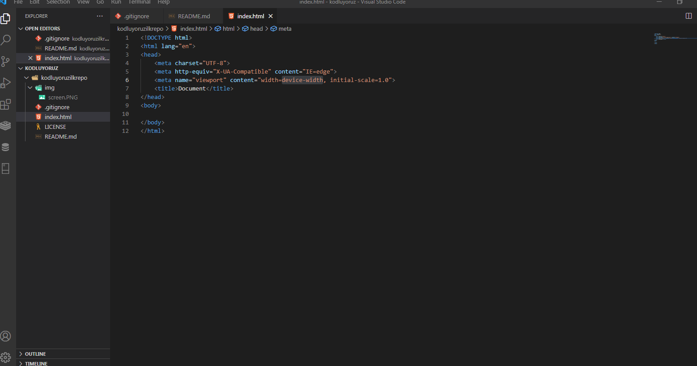

# Kodluyoruz Ilk Repo
Bu repo [Kodluyoruz](https://www.kodluyoruz.org/) veri bilimi eğitiminde oluşturduğumuz repo. İçerisinde bir adet README dosyası, bir adet de index.html barındırıyor.

# Installation
Öncelikle projeyi clonelayın (Buraya sizin reponuzdan aldığınız link gelecek) 
```
 git clone https://github.com/coderlawyer/kodluyoruzilkrepo.git 
```
# Usage 
Projeyi cloneladıktan sonra Visual studio code programında açınız.
Linux için :
```
    cd kodluyoruz
    code.
```
# Contributing
Pull requestler kabul edilir. Büyük değişiklikler için, lütfen önce neyi değiştirmek istediğinizi tartışmak için bir konu açınız.
# License
[MIT](https://choosealicense.com/licenses/mit/)